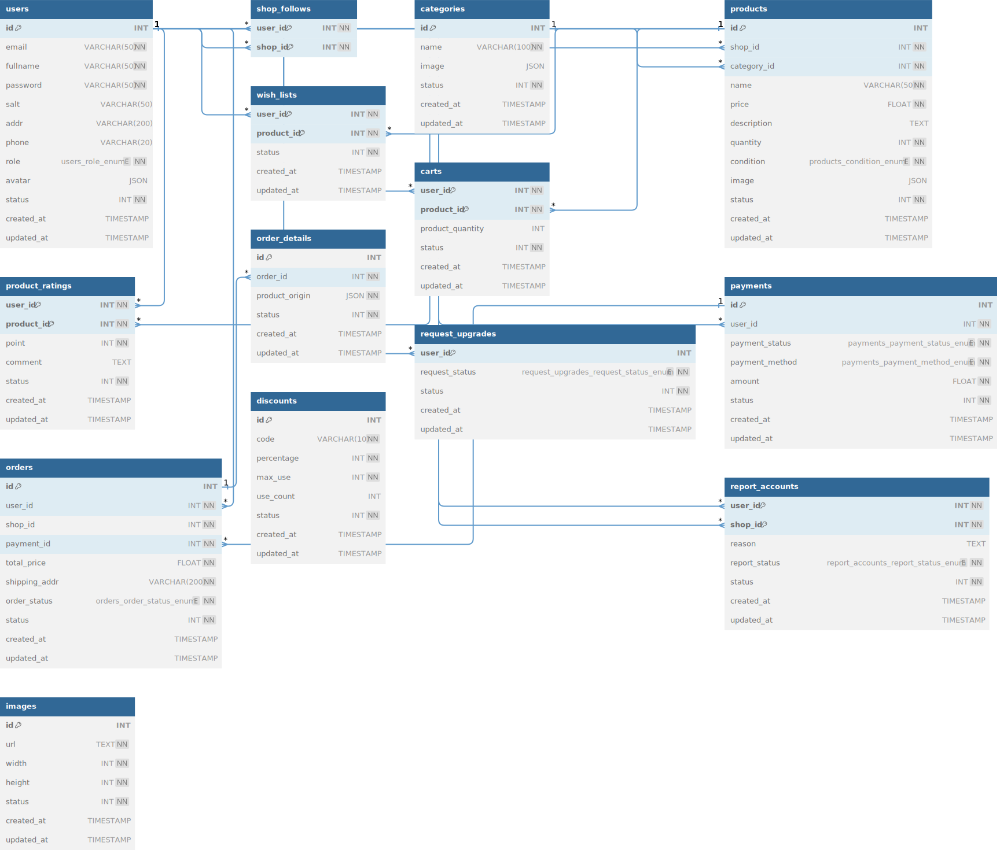
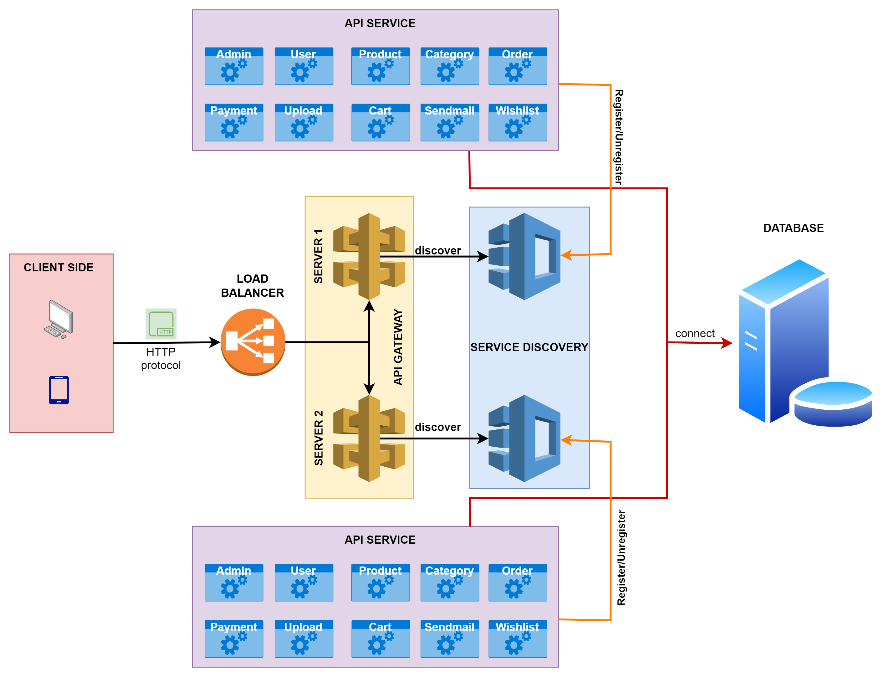

# 1. What is Shopbee?

Shopbee is an e-commerce platform for HCMUS students to buy and sell various items, including academic materials, clothing, and more. It also allows students to post specific product requirements and negotiate with potential sellers.

# 2. Database diagram

<p align="center">
  
</p>

# 3. Backend Architecture

<p align="center">
  
</p>

# 4. API Gateway Run

```
make deploy
```

# 5. Service Discovery Run

```
make deploy
```

# 7. Services Run

```
make deploy
```
